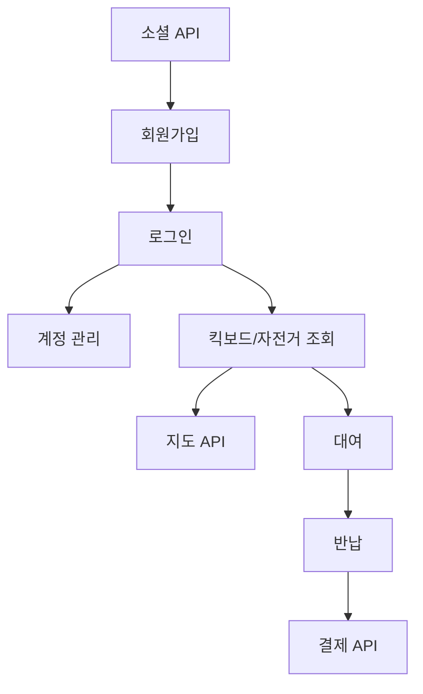

# 컴포넌트 다이어그램

---
# 기능 요구사항

## 1. 사용자 관리

### 1.1 회원가입 및 로그인
- **1.1.1 이메일 또는 소셜 미디어 계정을 통한 회원가입**
  - **1.1.1.1** 이메일 인증을 통한 계정 활성화 *(외부 이메일 인증 서비스 필요)*
    1. 서버는 고유한 인증 코드를 생성하여 이메일로 전송한다. *(구글 SMTP 서비스 사용)*
    2. 사용자가 이메일에 포함된 인증 코드를 입력하면, 서버에서 코드의 일치 여부를 확인한다.
  - **1.1.1.2** 소셜 미디어 계정 카카오 연동 *(카카오 API 필요)*
    1. 사용자가 인증을 완료하면, 서버는 카카오에서 제공하는 OAuth 토큰을 수신한다.
    2. 해당 토큰으로 카카오 사용자 정보를 가져와 계정을 생성하거나 기존 계정에 연동한다.
  - **1.1.1.3** 비밀번호 암호화 저장
    1. 서버는 입력된 비밀번호를 해시 알고리즘(Bcrypt)으로 암호화 하여 저장한다.
    2. 비밀번호 생성 및 변경 시 암호화 프로세스를 적용한다.
       
- **1.1.2 인증 및 권한 관리**
  - **1.1.2.1** 인증된 사용자만 접근 가능한 페이지 설정
    1. Spring Security를 사용하여 보호할 페이지를 설정한다.
    2. 인증되지 않은 사용자는 해당 페이지에 접근할 수 없도록 필터를 설정한다.
  - **1.1.2.2** 관리자 및 일반 사용자 권한 분리
    1. Spring Security에서 사용자와 관리자 역할을 설정한다.
    2. 특정 페이지나 AI에 대해 역할 기반으로 접근을 제어한다.
  - **1.1.2.3** Spring Security Filter 설정
    1. Spring Security에서 커스텀 필터를 설정하여 요청을 가로채고 처리한다.
    2. JWT 토큰을 검증하거나 사용자 권한을 확인하는 필터를 추가한다.
- **1.1.3 JWT 토큰**
  - **1.1.3.1** 토큰 생성 및 만료 설정
    1. 사용자가 로그인에 성공하면 서버는 엑세스 토큰과 리프레시 토큰을 생성한다.
    2. 클라이언트는 액세스 토큰을 로컬 스토리지에, 리프레시 토큰은 HttpOnly 쿠키에 저장한다.
  - **1.1.3.2** 토큰 갱신 기능
    1. 액세스 토큰이 만료되면, 클라이언트는 서버에 리프레시 토큰을 전송하여 새로운 액세스 토큰을 요청한다.
    2. 서버는 리프레시 토큰의 유효성을 검사하고, 유효하다면 새로운 액세스 토큰을 발급하여 클라이언트에 반환한다.
    3. 리프레시 토큰도 만료되었거나 유효하지 않다면, 클라이언트는 다시 로그인해야 한다.
  - **1.1.3.3** 토큰 기반의 사용자 정보 조회
    1. API 요청 시, 서버는 요청 헤더의 액세스 토큰을 확인한다.
    2. 토큰이 유효하다면 사용자 정보를 추출하여 인증된 사용자로 요청을 처리한다.
    3. 토큰이 만료되었다면 리프레시 토큰을 사용해 새 액세스 토큰을 발급하거나 요청을 거부한다.

### 1.2 개인정보 관리
- **1.2.1 프로필 정보 수정 (이름, 연락처, 주소 등)**
  - **1.2.1.1** 사용자 정보 조회 API
      1. 사용자 프로필 정보를 데이터베이스에서 조회하여 JSON 형식으로 반환한다.
  - **1.2.1.2** 사용자 정보 수정 API
      1. 사용자가 수정한 정보를 수신하고, 데이터베이스에 저장한다.
      2. 저장된 데이터를 반환하여 화면에 반영한다.
  - **1.2.1.3** 사용자 정보 저장 시 데이터 유효성 검사
      1. 이름, 연락처, 주소 등 필드의 유효성을 검증한다.
      2. 잘못된 데이터가 입력되면 오류 메시지를 반환한다.
- **1.2.2 결제 정보 등록 및 수정 (신용카드, 계좌 정보 등)**
  - **1.2.2.1** 결제 정보 암호화 및 저장
      1. 결제 정보를 암호화 알고리즘(AES 등)을 사용하여 암호화 후 데이터베이스에 저장한다.
  - **1.2.2.2** 결제 정보 수정 시 사용자 인증
      1. 결제 정보 수정 시 JWT 토큰을 통해 사용자를 확인한다.
      2. 인증이 완료되면 결제 정보를 수정할 수 있도록 허용한다.
  - **1.2.2.3** 결제 정보를 통한 기본 결제 수단 설정
      1. 사용자가 기본 결제 수단을 설정하면 데이터베이스에 이를 반영한다.
      2. 결제 시 기본 결제 수단을 자동으로 선택(데이터베이스에서 조회)한다.
- **1.2.3 이용 내역 조회**
  - **1.2.3.1** 사용자가 대여한 이력 조회
      1. 데이터베이스에서 사용자의 대여 기록을 조회한다.
      2. 조회된 데이터를 반환한다.
  - **1.2.3.2** 결제 내역 및 세부 정보 조회
      1. 결제 기록을 조회하고, 상세한 결제 정보를 포함하여 반환한다.
  - **1.2.3.3** 특정 기간 내 대여 기록 필터링
      1. 선택된 기간에 따라 대여 기록을 필터링하여 반환한다.

---

## 2. 대여 관리

### 2.1 실시간 위치 확인
- **2.1.1 외부 지도 API 연동**
  - **2.1.1.1** 카카오맵 API 연동 *(외부 지도 서비스 필요)*
      1. 프론트엔드: 카카오맵 API 설정, 지도 초기화, 위치 데이터 기반 마커 추가
      2. 킥보드/자전거의 위치 데이터를 데이터베이스에 저장한다.
      3. 사용자가 요청할 때 해당 위치 데이터를 클라이언트에 전송한다.
  - **2.1.1.2** 지도 API를 통한 실시간 위치 표시
      1. 서버는 일정 주기마다 위치 데이터를 클라이언트에 전송한다.
      2. 킥보드/자전거의 상태나 위치가 변경되면, 변경된 데이터를 데이터베이스에 업데이트하고 반환한다.
  - **2.1.1.3** 지도 내 반경 검색 기능
      1. 사용자가 설정한 반경 내의 위치 데이터를 필터링하는 로직을 추가한다.
      2. 특정 지점에서의 거리 계산을 통해 해당 반경 내에 있는 위치만 반환한다.

### 2.2 대여 및 반납 처리
- **2.2.1 QR 코드 스캔을 통한 대여 시작**
  - **2.2.1.1** QR 코드 생성 및 디스플레이   
      1. 각 킥보드/자전거의 고유 id를 기반으로 QR 코드 데이터를 생성한다.
      2. 이 QR코드는 대여 시 필요한 고유 정보를 포함해야 하며, 데이터베이스에 저장된다.
  - **2.2.1.2** QR 코드 스캔 시 대여 등록
      1. 서버는 스캔(전송)된 QR 코드 데이터를 수신하고, 해당 고유 ID에 해당하는 킥보드/자전거의 대여 가능 여부를 확인한다.
      2. 대여가 가능하다면 대여 시작 시간, 사용자 ID 등을 데이터베이스에 저장하고 대여 상태를 업데이트한다.
   - **2.2.1.3** QR 코드 데이터 유효성 확인
      1. 수신된 QR 코드 데이터가 유효한지(변조되지 않았는 지) 확인한다.
      2. 데이터가 유효하지 않으면 오류 메시지를 반환하고, 사용자는 대여를 다시 시도한다.
- **2.2.2 대여 종료 시 자동 결제 처리**
  - **2.2.2.1** 대여 종료 조건 확인
      1. 서버는 현재 위치가 반납 구역 내에 있는지 확인하고, 대여 종료 시간을 기록한다.
      2. 모든 대여 조건이 만족되면 대여를 종료하고 결제 절차를 시작한다.
  - **2.2.2.2** 결제 금액 계산 및 자동 결제
      1. 대여 종료 시점에서 시작 시간과 종료 시간, 이동 거리를 기반으로 요금을 계산한다.
      2. 결제 API(아임포트)를 호출하여 자동 결제를 처리하고, 결제 성공/실패 여부를 기록한다.*(외부 결제 서비스 필요)*
  - **2.2.2.3** 결제 실패 시 재시도 로직 구현
      1. 결제에 실패할 경우, 사용자에게 알림을 보내고, 자동으로 결제를 재시도하도록 설정한다.
      2. 최대 재시도 횟수를 설정하고, 모두 실패하면 수동 결제 요청을 사용자에게 전송한다.

### 2.3 요금 계산
- **2.3.1 기본 요금 및 시간당 추가 요금 계산**
  - **2.3.1.1** 시간당 요금 정책 설정
      1. 기본 요금: 600원, 분당 요금: 200원 요금 정책을 데이터베이스 저장하여 관리한다.
      2. 사용자가 대여를 시작하면 대여 시작 시간부터 종료 시간까지의 시간을 계산하여 요금을 부과한다.
  - **2.3.1.2** 결제 전 요금 확인 API
      1. 사용자가 대여를 종료하기 전에 현재까지의 예상 요금을 확인할 수 있는 API를 제공한다.
- **2.3.2 거리 기반 요금 옵션**
  - **2.3.2.1** GPS 기반 이동 거리 측정 *(외부 GPS 서비스 필요)*
  - **2.3.2.2** 거리 기반 요금 정책 설정
  - **2.3.2.3** 거리 계산 오차 보정

---

## 3. 결제 시스템

### 3.1 다양한 결제 수단
- **3.1.1 신용카드, 체크카드 결제**
  - **3.1.1.1** 카드 결제 모듈 연동 *(아임포트 API 필요)*
      1. 사용자가 결제를 요청하면, 서버는 아임포트 API를 사용해 카드 결제를 처리한다.
      2. 결제 요청 시 카드 정보와 요금을 전송하고 결제 성공/실패 여부를 반환받는다.
  - **3.1.1.2** 결제 시 카드 정보 유효성 체크
      1. 사용자가 입력한 카드 정보의 유효성을 검증한다.
      2. 카드 정보가 유효하지 않을 경우 결제를 거부하고 오류 메시지를 반환한다.
  - **3.1.1.3** 결제 성공/실패 응답 처리
      1. 결제 요청이 성공하면, 데이터베이스에 결제 정보를 저장한다.
      2. 결제 실패 시 사용자에게 알림을 전송하고, 재시도를 요청할 수 있다.
- **3.1.2 계좌이체**
  - **3.1.2.1** 실시간 계좌 인증
      1. 사용자가 계좌이체를 선택하면 실시간으로 계좌 인증을 진행한다.
      2. 인증이 완료되면 결제를 진행할 수 있도록 한다.
  - **3.1.2.2** 결제 대기 및 처리 상태 조회
      1. 계좌이체가 완료될 때까지 상태를 추적한다.
      2. 결제가 완료되면 데이터를 업데이트 하고, 상태를 '완료'로 변경한다.
  - **3.1.2.3** 계좌이체 완료 시 자동 알림
      1. 계좌이체가 완료되면 사용자에게 결제 완료 알림을 전송한다.
      2. 알림은 웹페이지 팝업 및 이메일을 통해 전달된다.
- **3.1.3 모바일 결제, 카카오페이**
  - **3.1.3.1** 모바일 결제 API 연동 *(카카오페이 API 필요)*
      1. 사용자가 카카오 API 결제를 선택하면, 서버는 카카오 페이 API를 사용해 결제 요청을 전송하고, 결제 상태를 모니터링한다.
  - **3.1.3.2** 결제 상태 모니터링
      1. 결제 상태를 주기적으로 확인하여, 결제가 성공했는지 여부를 추적한다.
      2. 결제가 실패하면 사용자에게 알림을 보내고 재시도를 요청할 수 있다.
  - **3.1.3.3** 모바일 결제 시 사용자 인증
      1. 결제 시 사용자의 신원을 확인한다.

---

## 4. 지도 및 내비게이션

### 4.1 대여소 및 반납 구역 정보
- **4.1.1 실시간 업데이트되는 대여 가능 킥보드/자전거 수량**
  - **4.1.1.1** 대여소 정보 저장 및 업데이트
      1. 각 대여소 정보를 관리하는 테이블을 생성한다.
      2. 대여소 정보가 변경될 때마다 데이터베이스를 업데이트한다.
  - **4.1.1.2** 대여 상태 변경 시 데이터 동기화
      1. 사용자가 킥보드/자전거를 대여하거나 반납할 때마다 해당 대여소의 상태(대여 가능 수량)를 업데이트한다.
      2. 데이터베이스 업데이트 후, 해당 정보를 캐싱 시스템(Redis 등)에 저장하여 빠른 조회를 가능하게 한다.
  - **4.1.1.3** 대여 가능한 수량 알림 설정
      1. 특정 대여소의 킥보드/자전거 수량이 임계값(예: 2대 이하) 이하로 떨어지면 관리자에게 알림을 보낸다.
      2. 알림 설정은 이메일, SMS, 또는 웹 푸시 알림을 통해 전달한다.
- **4.1.2 반납 가능 구역 하이라이트 표시**
  - **4.1.2.1** 반납 구역 설정 및 관리
      1. 반납 가능한 구역을 다각형(Polygon)형태로 정의하여 데이터베이스에 저장한다. 각 구역은 여러 좌표(위도/경도)를 통해 설정된다.
      2. 관리자는 관리 페이지에서 반납 구역을 생성, 수정, 삭제할 수 있다.
  - **4.1.2.2** 사용자 위치에 따른 반납 가능 구역 표시
      1. 사용자가 반납을 시도할 때, 현재 위치 좌표를 기준으로 반납 구역 내에 있는지 확인한다.
      2. 반납이 가능한 경우 대여 상태를 업데이트하고 결제 절차를 진행한다.
  - **4.1.2.3** 반납 구역에 따른 요금 차등 적용
      1. 반납 구역에 따라 요금을 다르게 설정한다. 예를 들어, 특정 인기 지역에 반납할 경우 할인 혜택 또는 추가 요금을 부과한다.

---

### 외부 서비스 필요 항목
- 이메일 인증: 구글 SMTP
- 카카오 소셜 계정 연동
-- GPS 서비스
- 카카오맵 API
- 아임포트 카드 결제 API
- 카카오페이 결제 API
---

